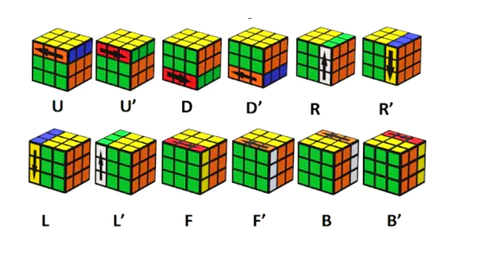

# Virtual-Rubik's-Cube

## Instructions

* Ensure that you're running Python 3.11
* Install all the requirements in requirements.txt through python pip. Please note that in order to install the kociemba library, a C compiler is required. 
* Execute the “run_program.py” file to initiate the program, launching the VPython window featuring a 3x3 Rubik's cube along with the control buttons below. Adjusting settings is possible through the following methods:
  * Hold down the right mouse button within the black box and move the mouse to rotate the cube
  * Use the scroll wheel within the black box to zoom in or out on the cube
  * Left-click on any edge or corner of the black box, then drag the mouse to modify the dimensions of the black box

## Cube Notation
For those unfamiliar with cube notation, please reference the image below:

Each letter corresponds to a specific move or rotation on a Rubik's Cube. These moves are as follows:

- **U:** Up face
- **D:** Down face
- **L:** Left face
- **R:** Right face
- **F:** Front face
- **B:** Back face

Additional symbols include:
- **' (prime):** Indicates a counter-clockwise rotation
- **2:** Denotes a double turn in the specified direction
